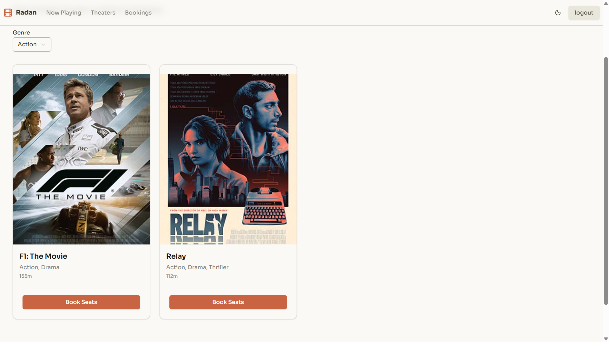
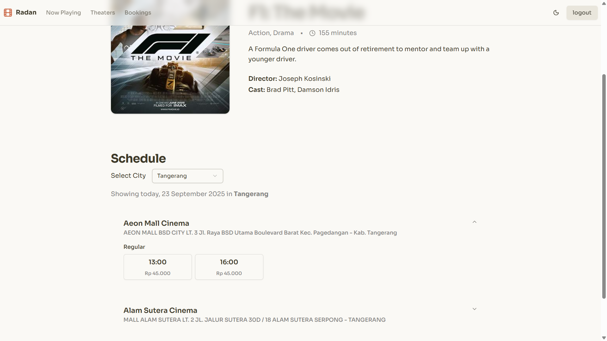
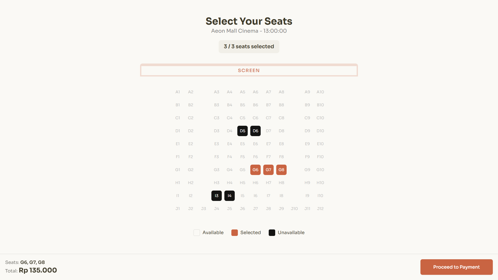
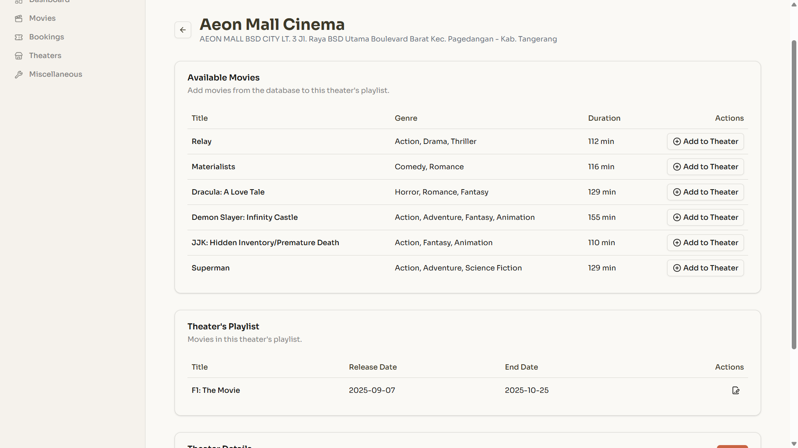
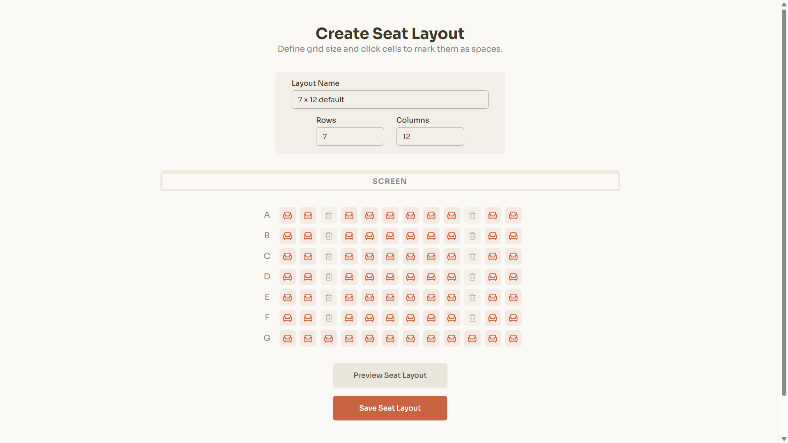

# 🌐 Radan

Radan is a web application that allows users to purchase movie tickets for theaters. It also provides an admin interface for managing movies and theaters within the Radan network.

---

## 🚀 Features

* 🔐 Book seats based on selected movies and theaters.
* 📡 Select seats through an intuitive visual layout.
* 🗄️ Create and customize seat layouts.
* 🎨 Admin dashboard to manage movies and theaters.

---

## 🛠️ Tech Stack

### Frontend

* **React** (Vite + TypeScript)
* **State Management:** Zustand
* **Styling:** TailwindCSS

### Backend

* **Spring Boot** (Java)
* **Spring Security** (Authentication)
* **Spring Data JPA** (Database interaction)
* **Database:** MySQL

---

## 📂 Project Structure

```
project-root/
 ├─ frontend/              # React + Vite + TypeScript app
 │   ├─ src/
 │   │   ├─ components/
 │   │   ├─ pages/
 │   │   ├─ stores/
 │   │   └─ services/
 │   └─ vite.config.ts
 │
 ├─ backend/               # Spring Boot app
 │   ├─ src/main/java/com/example/radan/
 │   │   ├─ controller/
 │   │   ├─ dto/
 │   │   ├─ entity/
 │   │   ├─ exceptions/
 │   │   ├─ repository/
 │   │   ├─ service/
 │   │   └─ RadanBackendApplication.java
 │   └─ src/main/resources/application.properties
 │
 └─ README.md
```

---

## ⚡ Getting Started

### 🔹 Backend (Spring Boot)

1. Navigate to the backend folder:

   ```bash
   cd backend
   ```

2. Configure your database connection in `src/main/resources/application.properties`. Example:

   ```properties
   spring.config.import=optional:classpath:application-secret.properties

   spring.application.name=radan-backend
   spring.datasource.url=jdbc:mysql://localhost:3306/radan
   spring.datasource.username=root
   spring.datasource.driver-class-name=com.mysql.cj.jdbc.Driver

   server.error.include-message=always

   file.upload-dir=./uploads/posters
   ```

3. Create a file named `application-secret.properties` in the same directory and add your database password:

   ```properties
   spring.datasource.password=your_password_here
   ```

4. Run the backend application:

   ```bash
   ./mvnw spring-boot:run
   ```

   The backend will start at: `http://localhost:8080`

---

### 🔹 Frontend (React + Vite + TypeScript)

1. Navigate to the frontend folder:

   ```bash
   cd frontend
   ```

2. Install dependencies:

   ```bash
   npm install
   ```

3. Create a `.env` file in the `frontend` folder with the following content:

   ```
   VITE_API_URL=http://localhost:8080
   VITE_IMAGE_URL=http://localhost:8080/images
   ```

4. Start the development server:

   ```bash
   npm run dev
   ```

   The frontend will be accessible at: `http://localhost:5173`

---

## 📸 Screenshots

*Now Playing Page*
<p align="center">
  
</p>

*Movide Detail Page*
<p align="center">
  
</p>

*Seat Selection Page*
<p align="center">
  
</p>

*Dashboard Theater Detail*
<p align="center">
  
</p>

*Create Seat Layout Page*
<p align="center">
  
</p>

---

